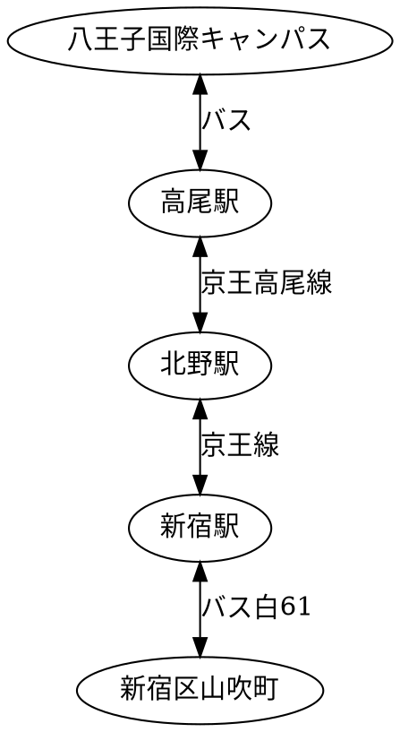

# オウホウの通学経路

[メンバー表に戻る](member.md#メンバー表)

```graphviz
digraph {
    edge [dir=both]
    八王子国際キャンパス -> 高尾駅 [label= バス]
    高尾駅 -> 北野駅 [label=京王高尾線]
    北野駅 -> 新宿駅 [label=京王線]
    新宿駅 -> 新宿区山吹町 [label=バス白61]

    
}
```
