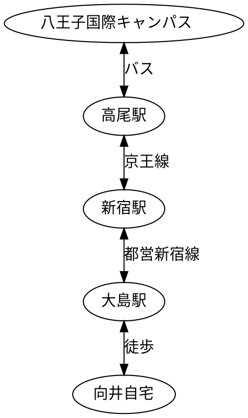

# 向井の通学経路

[メンバー表に戻る](member.md#メンバー表)

```graphviz
digraph {
    edge [dir=both]
    
    八王子国際キャンパス　-> 高尾駅 [label=バス]
    高尾駅 -> 新宿駅 [label=京王線]
    新宿駅 -> 大島駅 [label=都営新宿線]
    大島駅 -> 向井自宅 [label=徒歩]
}
```
